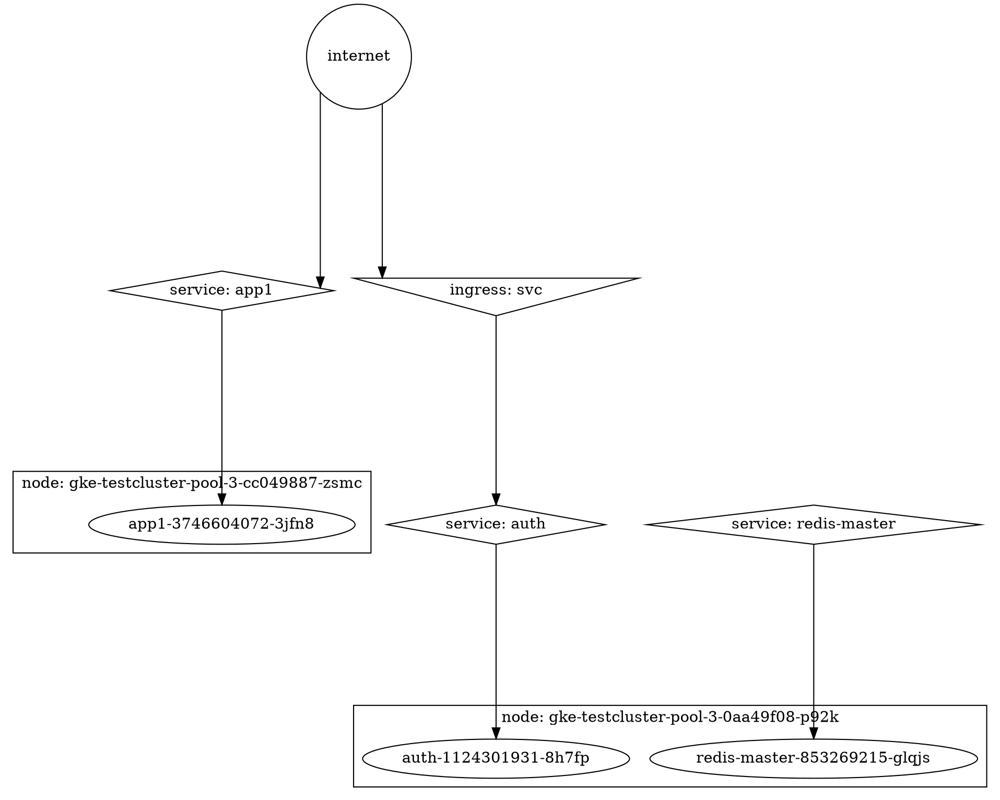

# node-k8s-dot-graph
[](https://nodei.co/npm/k8s-dot-graph/)

node.js library to create a dot graph (e.g. graphviz) from kubernetes objects. This lets you create a graph visualization of your kubernetes cluster.

Inputs are the kubernetes object lists from the k8s api endpoints for NodeList, PodList, ServiceList, and IngressList and output is a string in dot format representing the kubernetes cluster.

If you want to just generate a .dot or .svg using `kubectl` check out <https://github.com/chrishiestand/k8s-network-graph> instead.

## Example Code

```javascript
import kdg from 'k8s-dot-graph'

async function main() {
  const nodeList    = await getNodeList()
  const podList     = await getPodList()
  const ingressList = await getIngressList()
  const serviceList = await getServiceList()

  const dotGraphString = kdg.makeDotGraph({nodeList, serviceList, podList, ingressList})
}

```

## Options

`makeDotGraph()` accepts the following dot format options with defaults shown:

```javascript

kdg.makeDotGraph({
  nodeList,
  serviceList,
  podList,
  ingressList,
  splines      : 'ortho',
  sep          : '6.2',
  ranksep      : '2.0 equally',
  internetShape: 'circle',
})
```

## Installation
`npm install k8s-dot-graph`

## Example Output

This is an example of a small 2-node, 3-pod cluster. These get much larger.



### Example Visualized


## Contributions

Issues/PRs are welcome.

### Possible TODO Items

* Simplify/expand dot file options
* Add version support for kubernetes API (currently tested against 1.6)
* Add support for additional kubernetes objects?
